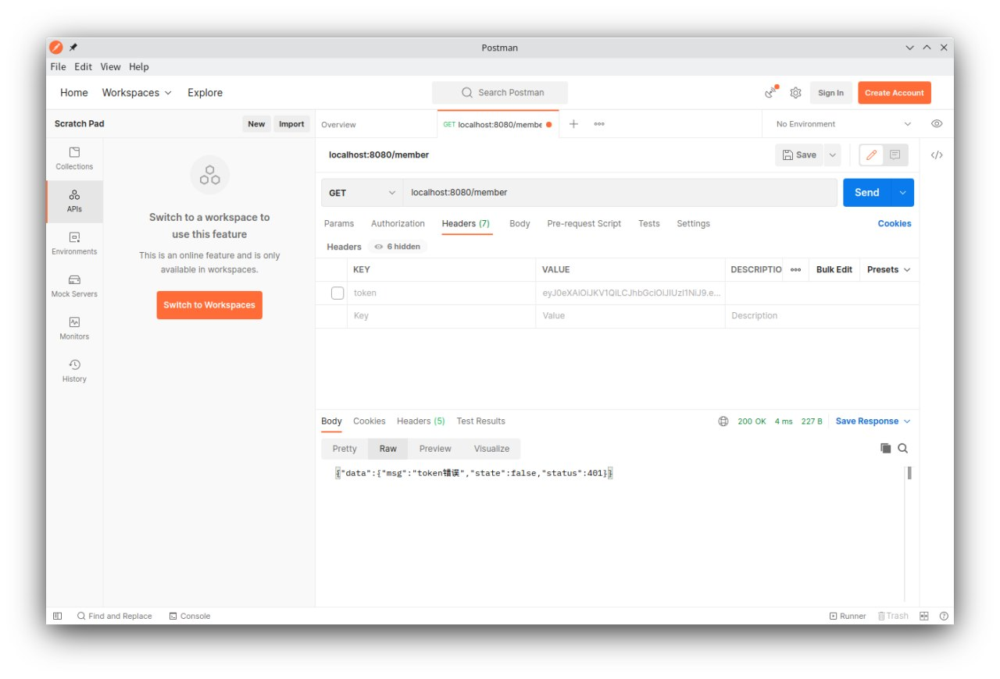
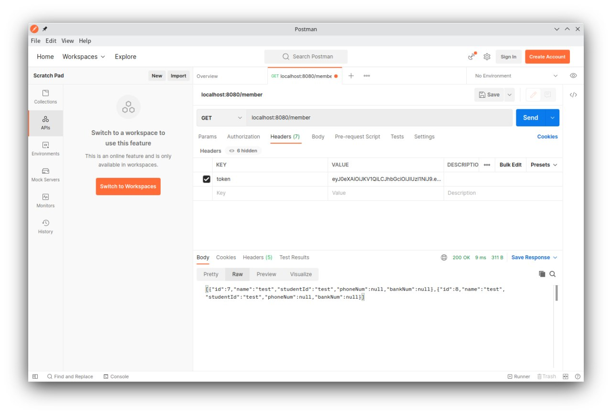

# 网管会管理系统

## 技术栈

- 后端框架: Spring Boot
- 数据库: PostgreSQL
- 数据库连接池: Druid
- 数据库持久化: MyBatis 3
- 前端框架: 预期为 Vue

## 预期功能

- [X] 设备数据库
- [X] 人员数据库
- [ ] 招新数据库
- [X] 用户管理和登陆
- [ ] SSO 支持

## 部署方式

**运行环境：**Java 11

**修改密钥：**为了安全性，先在 `src/main/java/org/netunion/manager/utils/JwtUtils.java` 中修改 `SECRET_KEY`。

**建立数据库：**安装 `PostgreSQL` 数据库，先新建数据库，并执行下面的命令

```SQL
CREATE TABLE public.device (
	id serial4 NOT NULL,
	device_type varchar(10) NULL,
	manage_ip inet NULL,
	name varchar(10) NOT NULL DEFAULT NULL::character varying,
	rack_no varchar NULL
);
CREATE TABLE public."member" (
	id int4 NOT NULL DEFAULT nextval('user_id_seq'::regclass),
	"name" varchar(32) NOT NULL,
	student_id varchar(32) NOT NULL,
	phone_num varchar(11) NULL,
	bank_num varchar(19) NULL
);
CREATE TABLE public."user" (
	username varchar NOT NULL,
	hashed_password varchar NOT NULL,
	id serial4 NOT NULL
);
```

**建立管理员账户**：在 `user` 表中添加管理员账户，`hashed_password` 字段应和前端实际得到的哈希后的密码一致。

**打包和部署：**执行 `mvn clean package`，会在 `target` 中生成 JAR 文件，然后 `java -jar manager.jar` 即可，服务端运行在 8080 端口。

## API

### 用户管理和登陆

#### 用户管理

用户类包括三个变量：`userName`, `hashedPassword` 和 `id`，对应的数据库字段为`user_name`、`hashed_password`和`id`。

对于用户的操作如下：

- `/user` GET 获取所有用户信息（JSON格式）
- `/user/{username}` GET 通过 ID 获取指定用户信息（JSON格式）
- `/user/{id}` GET 通过用户名获取指定用户信息（JSON格式）
- `/user/add` POST 添加一个用户（JSON格式）
- `/user/delete/{id}` DELETE 通过 ID 删除指定用户
- `/user/update/password` POST 修改密码

#### 对于密码哈希和修改密码的说明

为了能够正常登陆，应当手动在数据库的 `user` 表中添加一个用户。

在创建新用户时，密码会直接传入数据库，故应当在前端做哈希处理。（以后可能会改进）

修改密码时，POST一个表单，包括`id`、`oldPassWord`、`newPassWord`，其中`id`为用户ID，`oldPassWord`为旧密码，`newPassWord`为新密码。失败的话会返回 `WRONG PASSWORD`。

#### 登陆

登陆时，将 `userName` 和 `hashedPassword` 作为表单传入 `/login/token`，会自动进行用户存在与否和密码是否正确的检查（也可直接传入 `login/check` 检查返回的布尔值）检查正确后会返回 JWT 格式的 `token`，在访问其他 API 时需要在请求头中添加 `token` 字段。

  

  

### 成员管理

- `/member` GET 获取所有成员信息（JSON 格式）
- `/member/{id}` GET 获取单个成员信息（JSON格式）
- `/member/add` POST 添加人员，传入 JSON，必须且仅能包括 `name`、`studentId` 两个字段，若包含其他字段，不会报错但不会录入数据库
- `/member/delete/{id}` DELETE 删除指定成员
- `/member/update/bank` POST 为人员添加或更新银行卡号，传入表单，包括 `id`、`bankNum` 两个字段
- `/member/update/phone` POST 为人员添加或更新手机号，传入表单，包括 `id`、`phoneNum` 两个字段

### 设备管理

- `/device` GET 获取所有设备信息（JSON 格式）
- `/device/{id}` GET 获取单个设备信息（JSON格式）
- `/device/add` POST 添加设备，传入 JSON，包括 `deviceType`、`name` 两个字段，若包含其他字段，不会报错但不会录入数据库
- `/device/delete/{id}` DELETE 删除指定设备
- `/device/update/type` POST 为设备添加或更新类型，传入表单，包括 `id`、`deviceType` 两个字段
- `/device/update/name` POST 为设备添加或更新名称，传入表单，包括 `id`、`name` 两个字段
- `/device/update/manageIp` POST 为设备添加或更新管理 IP，传入表单，包括 `id`、`manageIp` 两个字段
- `/device/update/rackNo` POST 为设备添加或更新架号，传入表单，包括 `id`、`rackNo` 两个字段

### 返回值类型

获取信息会返回JSON或null，添加新成员/设备操作会返回如下形式的字符串

```text
Member{id=6, name='test', studentId='test', phoneNum='null', bankNum='null'}
```

若要为成员/设备添加或更新其他字段，成功后会返回与上文类似的字符串，失败则会返回 `EMPTY ID` 或 `FAILED` 等字符串。
